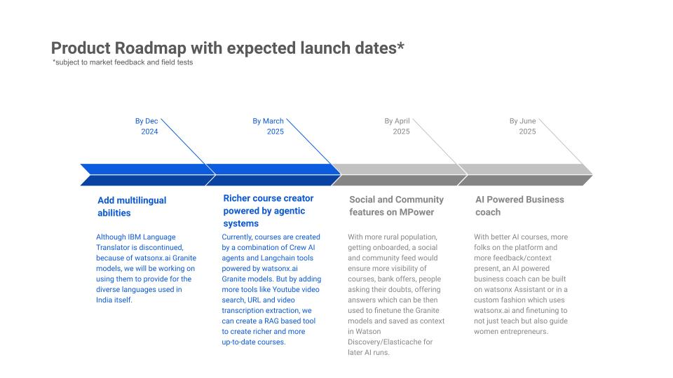

# MPower - Empowering women through AI driven personalised courses

- [Project summary](#project-summary)
  - [The issue we are hoping to solve](#the-issue-we-are-hoping-to-solve)
  - [How our technology solution can help](#how-our-technology-solution-can-help)
  - [Our idea](#our-idea)
- [Technology implementation](#technology-implementation)
  - [IBM watsonx product(s) used](#ibm-watsonx-products-used)
  - [Other IBM technology used](#other-ibm-technology-used)
  - [Solution architecture](#solution-architecture)
- [Presentation materials](#presentation-materials)
  - [Solution demo video](#solution-demo-video)
  - [Project development roadmap](#project-development-roadmap)
- [Additional details](#additional-details)
  - [How to run the project](#how-to-run-the-project)

## Project summary

### The issue we are hoping to solve

Women in climate-affected areas often face economic instability as climate change disrupts traditional livelihoods like agriculture, livestock rearing, and fishing. In many communities, women are already economically marginalised, and climate-induced loss of income exacerbates poverty and gender inequality. Finding sustainable, alternative livelihood opportunities is challenging, especially in rural areas with limited access to formal education, resources, or markets.

### How our technology solution can help

MPower focuses on using generative AI to provide climate-affected women with sustainable, alternative livelihoods.

### Our idea

Many women, particularly in rural and agricultural communities, like Africa, India, SE Asia, depend on climate-sensitive industries like farming, livestock rearing, or fishing. As climate change disrupts weather patterns, causes crop failures, or diminishes water resources, these women are left vulnerable to losing their primary source of income.

MPower would use generative AI to create tailored livelihood suggestions based on available local resources, skills, and climate conditions. It could help women transition to new, sustainable income-generating activities that are more resilient to climate change. The AI could also generate business ideas, provide training recommendations, and connect users to microfinance loan programs.

Real life usecases are available in our [description document](./DESCRIPTION.md).

## Technology implementation

### IBM watsonx product(s) used

- [watsonx.ai](https://www.ibm.com/products/watsonx-ai)
  - Used as the primary LLM and function calling LLM in [crew.ai](https://crew.ai) agentic system for creating personalised courses
    - [Usecase 1]()
    - [Usecase 2]()
  - Used for generating vector embeddings for storing course and bank offer details in vector store
    - [Usecase 1]()
    - [Usecase 2]()
  - Used as the chat LLM for asking course or bank offer related queries
    - [Usecase 1]()
    - [Usecase 2]()
  - Used as the LLM integration for watsonx Assistant to get AI powered answers
    - [Usecase 1]()

- [watsonx Assistant](https://cloud.ibm.com/catalog/services/watsonx-assistant)
  - Used as the chat interface for students to interact and get suggested course ideas by integrating with watsonx.ai
    - [Usecase 1]()

### Other IBM technology used

- [Watson Machine Learning](https://cloud.ibm.com/catalog/services/watson-machine-learning) 
  - Used for setting up watsonx.ai and watsonx Assistant

- [Watson Studio](https://cloud.ibm.com/catalog/services/watson-studio)
  - Used for setting up watsonx.ai and watsonx Assistant
  - Used for prototyping and testing prompts which finally went into the respective LLMs above

- [Speech to Text](https://cloud.ibm.com/catalog/services/speech-to-text)
  - Used as an alternative medium to take user inputs for the chat interface
    - [Usecase 1]()

- [Text to Speech](https://cloud.ibm.com/catalog/services/text-to-speech)
  - Used as TTS for LLM chat responses in the chat interface
    - [Usecase 1]()

### Solution architecture

#### For Courses

1. The user comes to the webapp (web/mobile) and asks AI to create a course
2. Basic information regarding the course is saved on Postgres DB and then sent to Celery workers for creating the course
3. Crew AI agentic system picks up the tasks and using a combination of watsonx.ai Granite LLMs and Langchain tools, create a complete course end-to-end
4. The course is then converted into embeddings using watsonx.ai embedding models and stored in ElasticDB (ChromaDB for testing)
5. When the user goes through the course, she sees a AI chatbot. When she queries the chatbot for questions and doubts, an AI generated response is returned by running RAG on watsonx.ai models and previously created embeddings
6. (Optional) Users can ask questions through speech to the AI chatbot via IBM Speech to Text
7. (Optional) Users can listen to AI responses through IBM Text to Speech
8. User can also ask Watsonx Assistant chatbot for course suggestions based on her profile

#### For Bank Offers

1. The bank officer comes to the webapp (web/mobile) and adds a new microfinance loan offer
2. Basic information regarding the bank is saved on Postgres DB and then sent to Celery workers for extracting data from the bank offer pdf and url
3. A celery process picks up the task and using a combination of watsonx.ai Granite LLMs and Langchain tools, extracts all information regarding the loan from the bank offer pdf and bank url
4. The offer details are then converted into embeddings using watsonx.ai embedding models and stored in ElasticDB (ChromaDB for testing)
5. When the user checks out all the bank offers, she sees a AI chatbot. When she queries the chatbot for questions and doubts, an AI generated response is returned by running RAG on watsonx.ai models and previously created embeddings
6. (Optional) Users can ask questions through speech to the AI chatbot via IBM Speech to Text 
7. (Optional) Users can listen to AI responses through IBM Text to Speech
8. This step is not relevant for bank offers

## Presentation materials

### Solution demo video

### Project development roadmap

MPower currently does the following things.

- AI powered course suggestions based on the students' profiles
- AI powered personalised course builder
- AI chatbot to ask course related doubts
- AI powered tool to analyse bank offers and build a knowledge base
- AI chatbot to ask best bank offers and offer related doubts
- TTS and STT features on our AI chatbot for easier usage

In the future we plan to
- Provide multilingual support to address the needs of rural women from diverse backgrounds
- Build a richer course creator functionality powered by Granite models
- Incorporate social and community tools for women entrepreneurs across the world to interact and share their knowledge
- Launch V1 of an AI powered business coach to not just help women entrepreneurs learn new business courses but also help them launch, scale and become financially successful in their endeavour

See below for our proposed schedule on next steps after Call for Code 2024 submission.

## Additional details

### How to run the project

#### Backend

1. Run `cd backend/`
2. Make a copy of `.env.sample`, name it `.env` and fill the variables
3. Run `docker-compose -f docker-compose.yml build`
3. Run `docker-compose -f docker-compose.yml up`

#### Frontend

1. Run `cd frontend/`
2. Run `npm install`
3. Make a copy of `.env.sample`, name it `.env` and fill the variables
4. Run `npm run start`

## Contributors:

* [Saumo Pal](https://github.com/SaumoPal97)
